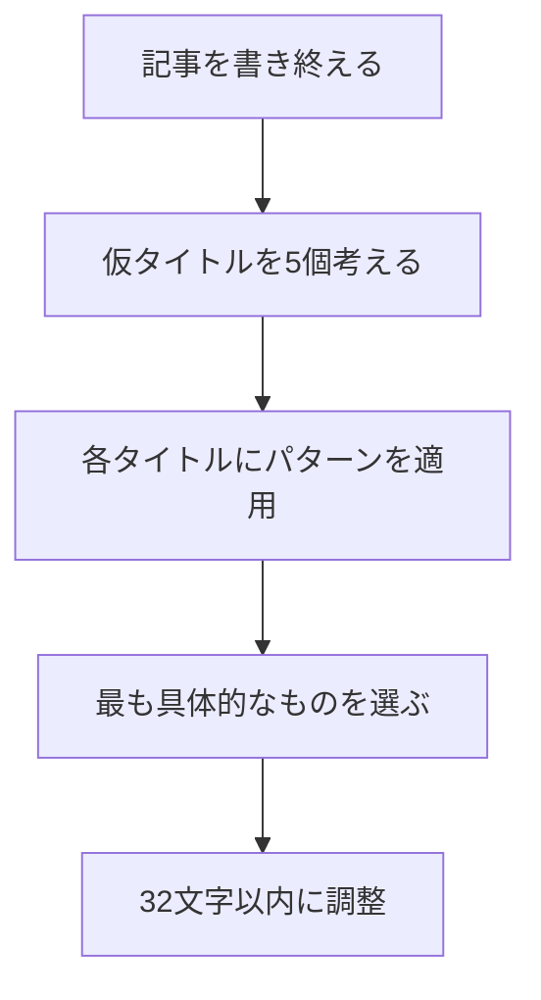

# ブログの始め方入門 #02 - タイトル術

> ⚠️ **注意**: このシリーズの内容はすべて生成AIによって作成されたサンプルコンテンツです。記載されている情報の正確性は検証されておらず、裏取りも行っていません。実際のブログ運営に活用する際は、ご自身で内容を確認してください。

**前回**: [テーマの選び方](/sample-blog/blog/blog-start-01-theme-selection.html)

---

## タイトルは記事の「顔」

どんなに素晴らしい記事を書いても、**タイトルが悪ければ誰にも読まれません**。

SNSのタイムラインや検索結果で、ユーザーがタイトルを見る時間はわずか**0.5〜1秒**。この一瞬で「読みたい！」と思わせる必要があります。

## クリックされるタイトルの科学

### CTR（クリック率）の重要性

$$
\text{PV} = \text{インプレッション} \times \text{CTR}
$$

同じインプレッション数でも、CTRが2倍になればPVも2倍になります。タイトル改善は最もコスパの良い施策です。

### 良いタイトルの条件

| 要素 | 説明 | 例 |
| --- | --- | --- |
| 具体性 | 数字や固有名詞を含む | 「5つの方法」「React入門」 |
| メリット | 読者が得られる価値 | 「〜できるようになる」 |
| 緊急性 | 今すぐ読むべき理由 | 「知らないと損する」 |
| 好奇心 | 続きが気になる仕掛け | 「実は〜だった」 |

## 効果的なタイトルパターン7選

### パターン1: 数字を入れる 🔢

人間の脳は数字に惹かれます。

**悪い例**: プログラミング学習のコツ  
**良い例**: **プログラミング学習で挫折しない7つのコツ**

<details>
<summary>なぜ数字が効果的なのか？</summary>

心理学的に、数字には以下の効果があります：

1. **具体性**: 抽象的な内容が具体的に感じられる
2. **読了時間の予測**: 「7つなら5分で読めそう」と思える
3. **スキャンしやすさ**: タイムライン上で目立つ

奇数のほうがクリック率が高いという研究結果もあります。[^1]

</details>

### パターン2: ハウツー形式

「〜の方法」「〜のやり方」は定番かつ強力です。

```
【基本形】
○○する方法
○○のやり方完全ガイド
初心者でもできる○○入門
```

### パターン3: 問いかけ形式 ❓

読者の疑問をそのままタイトルにします。

- 「なぜプログラマーはMacを使うのか？」
- 「ブログは本当にオワコンなのか？」

### パターン4: ネガティブフレーム

人間は「損失回避」の傾向があります。

> ⚠️ **注意**: 煽りすぎると信頼を失います

**例**:
- 「知らないと損する確定申告の基礎知識」
- 「やってはいけないGitの使い方5選」

### パターン5: ターゲットを明示

誰に向けた記事かを明確にします。

- 「**新卒エンジニア向け**：最初に覚えるべきLinuxコマンド」
- 「**非デザイナーのための**UIデザイン入門」

### パターン6: 比較形式

2つ以上の選択肢を比較するタイトルです。

```
A vs B：どちらを選ぶべき？
AとBの違いを徹底比較
```

### パターン7: 実体験を示す

一次情報であることをアピールします。

- 「3年間ブログを続けてわかった**本当のこと**」
- 「未経験からエンジニア転職した**リアルな体験談**」

## タイトル作成のワークフロー

私が実践しているタイトル作成の手順を紹介します：



### ステップ1: 仮タイトルを5個書き出す

最初から完璧を目指さず、まずは量を出します。

### ステップ2: パターンを適用する

前述の7パターンを組み合わせて改善します。

### ステップ3: 32文字以内に調整

検索結果やSNSで切れないように、**32文字以内**を目安にします。

## 実践：タイトルを改善してみよう

以下のタイトルを改善してみましょう：

**Before**: Pythonの基礎

**After案**:
1. 「Python入門：初心者が最初に学ぶべき5つの基礎」
2. 「【2025年版】Python基礎文法を1時間でマスターする方法」
3. 「なぜPythonなのか？他の言語と比較してわかった強み」

## よくある失敗パターン

### ❌ 失敗1: 曖昧すぎる

```diff
- 私の考え
+ ブログを3年続けて気づいた、継続の本質
```

### ❌ 失敗2: 長すぎる

```diff
- 【完全保存版】初心者からプロまで使える最強のGit入門ガイド〜基礎から応用まで網羅〜
+ Git入門完全ガイド：初心者が知るべき基礎と応用
```

### ❌ 失敗3: 釣りタイトル

クリックさせることだけを考えた「釣り」タイトルは、読者の信頼を失います。

> タイトルで約束したことは、**必ず本文で果たす**

## タイトル評価チェックリスト

記事を公開する前に確認しましょう：

- [x] 32文字以内に収まっているか
- [x] 具体的な数字やキーワードが含まれているか
- [x] 読者のメリットが伝わるか
- [x] 検索キーワードが含まれているか
- [x] 本文の内容と一致しているか

## A/Bテストのすすめ

タイトルの効果は、実際にテストして検証することが重要です。

| タイトルA | タイトルB | 結果 |
| --- | --- | --- |
| Git入門 | 【図解】Git入門：初心者向け完全ガイド | B +45% |
| Python学習法 | Pythonを最速で習得する5つの学習法 | B +62% |
| 確定申告のやり方 | 確定申告で損しない！会社員向け完全マニュアル | B +38% |

[^1]: Content Marketing Instituteの調査（2023年）による。奇数を含むタイトルは偶数より20%高いCTRを示した。

## まとめ

タイトル術のポイント：

1. **数字を入れる** - 具体性と信頼性が増す
2. **読者のメリットを示す** - 「読んだら何が得られるか」を明確に
3. **32文字以内に収める** - 検索結果やSNSで切れないように
4. **パターンを組み合わせる** - 7つのパターンを武器にする

良いタイトルが書けたら、次は記事本文の構成を学びましょう ✍️

---

**次回**: [読みやすい文章構成 - 離脱されない記事の書き方](/sample-blog/blog/blog-start-03-article-structure.html)

**前回**: [テーマの選び方](/sample-blog/blog/blog-start-01-theme-selection.html)

